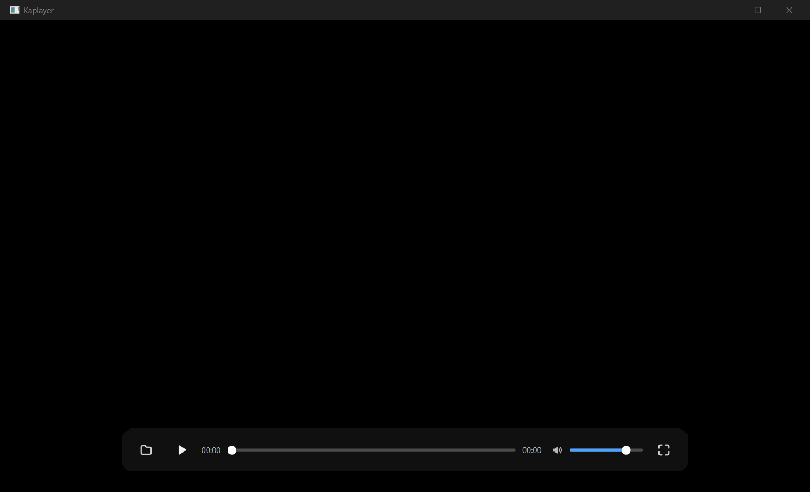

# Kaplayer

A modern, minimal desktop media player built with **Qt 6** and C++.



Kaplayer keeps the interface out of your way: a single floating control bar
hovers over the video and hides itself after a few seconds of inactivity,
leaving nothing but the picture.

## Features

- **Floating auto-hiding toolbar** — appears on mouse movement or any key
  press, hides while you watch, never hides under your cursor
- **Dark theme throughout** — one stylesheet ([Themes/dark.qss](Themes/dark.qss))
  drives every control, tooltip included
- **Precise seeking** — click anywhere on the timeline, drag the handle, or
  tap the arrow keys; playback lands exactly where you point, with no
  handle bounce while the decoder catches up
- **Perceptual volume** — the slider maps logarithmically, so halfway
  actually sounds like halfway
- **Fullscreen** — double-click the video, press <kbd>F</kbd>, or use the
  toolbar button; <kbd>Esc</kbd> exits
- **Wide format support** — MP4, MKV, AVI, MOV, WebM via Qt Multimedia's
  FFmpeg backend

## Keyboard shortcuts

| Key | Action |
|---|---|
| <kbd>Space</kbd> | Play / pause |
| <kbd>F</kbd> | Toggle fullscreen |
| <kbd>Esc</kbd> | Exit fullscreen |
| <kbd>Ctrl</kbd>+<kbd>O</kbd> | Open a video file |
| <kbd>←</kbd> / <kbd>→</kbd> | Seek 5 seconds back / ahead |
| <kbd>↑</kbd> / <kbd>↓</kbd> | Volume up / down |

Shortcuts are global within the window — they work no matter which control
you last clicked.

## Download

Grab the latest self-contained Windows x64 build from
[**Releases**](https://github.com/kirpurva/kaplayer/releases) — unzip
anywhere and run `kaplayer.exe`. No installation required.

## Building from source

Requirements: **Qt 6.5+** (Widgets, Multimedia, MultimediaWidgets, SVG),
a C++17 compiler, and CMake 3.16+ (a qmake project file is also provided).

```sh
# CMake
cmake -S . -B build -DCMAKE_BUILD_TYPE=Release -DCMAKE_PREFIX_PATH=<path-to-Qt-kit>
cmake --build build
```

Or open `CMakeLists.txt` / `kaplayer.pro` in Qt Creator and hit Run.

To package a distributable Windows build:

```sh
windeployqt --release --compiler-runtime path/to/kaplayer.exe
```

## Project layout

| Path | Purpose |
|---|---|
| `mainwindow.cpp/.h` | Player window, toolbar, playback and input logic |
| `Themes/dark.qss` | The single source of truth for all styling |
| `icons/` | Minimal SVG icon set used by the toolbar |
| `resources.qrc` | Compiles the theme and icons into the binary |
